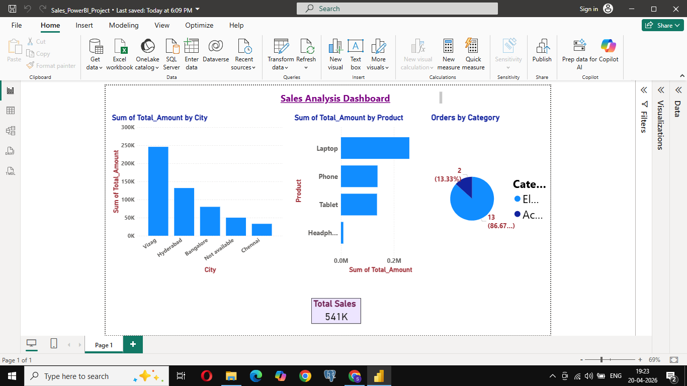
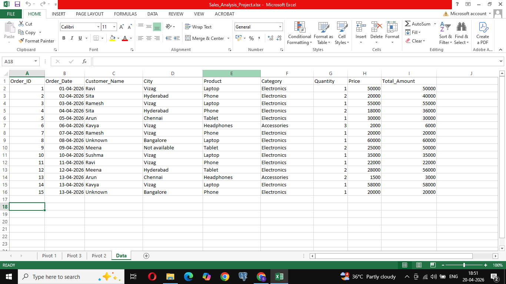
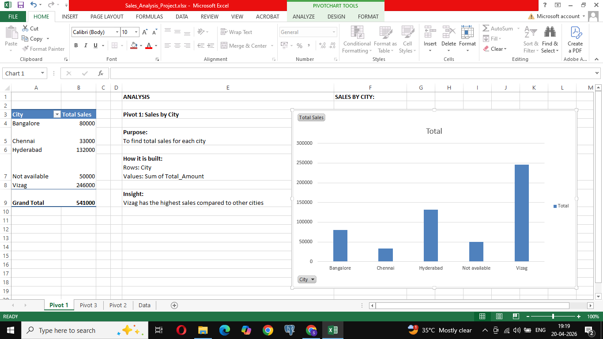
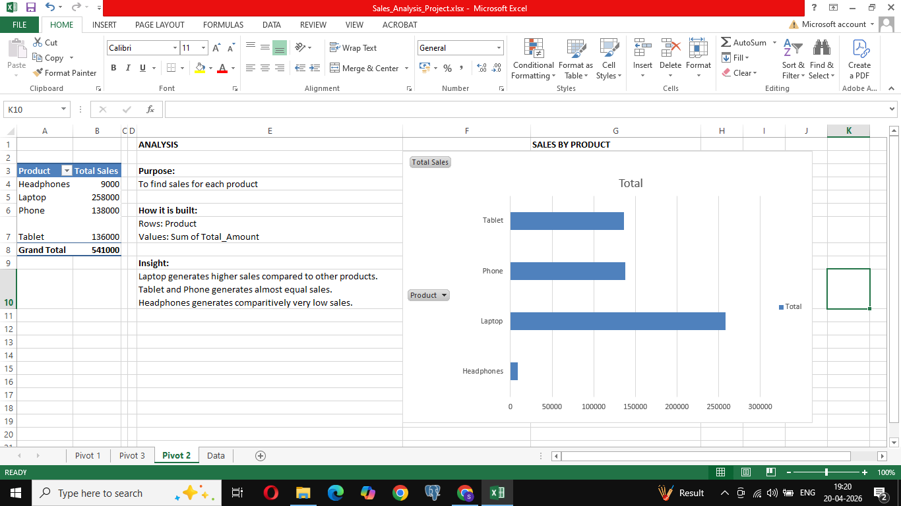
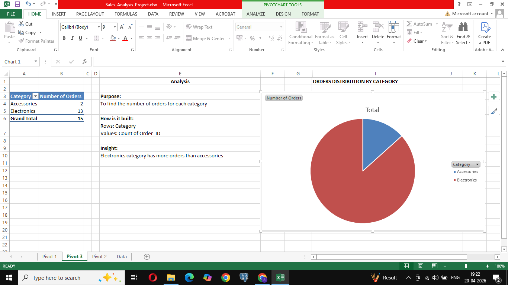

# Sales Analysis Project (Excel + Power BI)

## Project Overview

This project focuses on analyzing sales data using Excel and Power BI. The goal is to clean raw data, perform calculations, build pivot tables, and create interactive dashboards to generate meaningful business insights.

## Tools & Technologies Used

* Microsoft Excel
* Power BI Desktop
* Data Visualization
* Pivot Tables

## Dataset Description

The dataset contains sales transaction details including:
- Order ID
- Order Date
- City
- Product
- Category
- Quantity
- Price
- Total Amount

## Data Preparation & Cleaning

- Removed unnecessary summary rows (Total, Average, Count rows)
- Ensured correct date formatting
- Verified data consistency
- Created calculated column: Total Amount = Quantity * Price

## Excel Analysis

- Created calculated fields using formulas:
    * SUM of Total Sales
    * Average Sales
    * Count of Orders
- Built Pivot Tables:
    1. Sales by City
    2. Sales by Product
    3. Sales by Category
- Designed charts:
    * Column Chart
    * Bar Chart
    * Pie Chart

## Power BI Dashboard

- Imported cleaned Excel dataset into Power BI
- Created interactive visuals:
    1. Sales by City (Column Chart)
    2. Sales by Product (Bar Chart)
    3. Sales by Category (Pie Chart)
- Added KPI Card:
    * Total Sales
- Applied formatting for better visualization and readability

## Key Insights

- Vizag generated the highest sales
- Electronics category contributed the majority of revenue
- Total sales reached 541K, indicating overall performance
- Accessories category had comparitively lower sales

## Dashboard Preview

### Power BI Dashboard

### Excel Data Sheet

### Pivot Table 1

### Pivot Table 2

### Pivot Table 3

## Key Learnings

- Data cleaning and preprocessing techniques
- Pivot table analysis in Excel
- Building interactive dashboards in Power BI
- Data visualization best practices

## Acknowledgement

This project was created as a part of my learning journey in Data Analytics, focusing on practical hands-on experience with Excel and Power BI.

